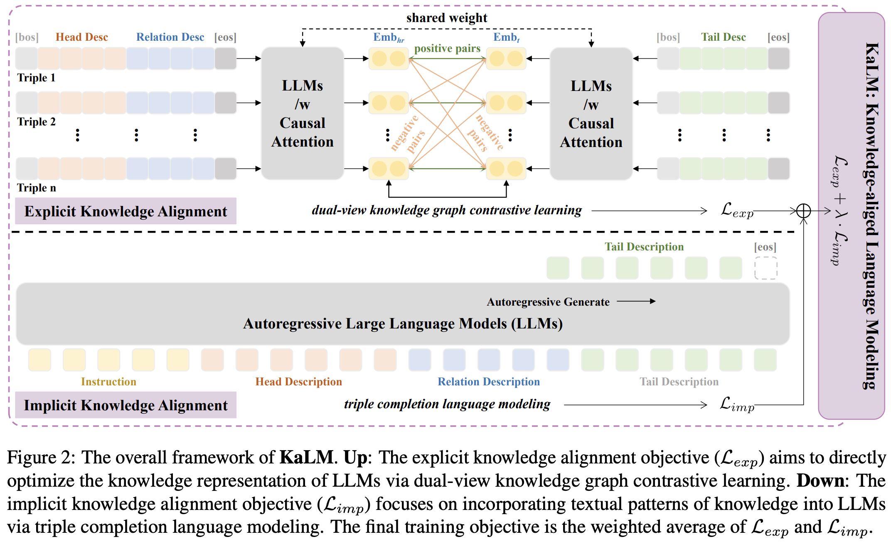
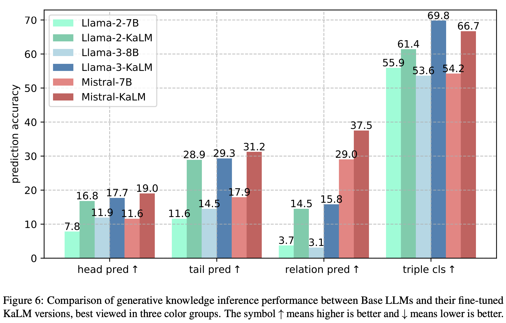

# KaLM: Knowledge-aligned Language Modeling

This repository contains code for the paper: 
*KaLM: Knowledge-aligned Autoregressive Language Modeling via Dual-view Knowledge Graph Contrastive Learning*. (COLING 2025)



## Setup

Download this repository and install the necessary requirements.
```shell
conda env create -f environment.yaml
```

## Finetuning

Fine-tuning the model using the LoRA method and deepspeed ZeRO-2 optimization.

```shell
CUDA_VISIBLE_DEVICES=0,1,2,3 accelerate launch --config_file=config_w_ds_n4.yaml src/kalm_finetuning.py \
    --dataset_path data/wn18rr \
    --output_dir llama_models/kalm_wn18rr_ckpt \
    --learning_rate 1e-4 \
    --per_device_train_batch_size 24 \
    --sft_batch_size 4 \
    --ent_cutoff_len 50 \
    --sft_cutoff_len 256 \
    --log_steps 1 \
    --save_steps 1000 \
    --num_gpus 4 \
    --num_train_epochs 20 \
    --use_kge_loss True \
    --use_lm_loss True \
    --loss_alpha 0.01
```

## Evaluation

Evaluate on the embedding-based knowledge graph completion (KGC) task.

```shell
CUDA_VISIBLE_DEVICES=0 python src/eval_kgc.py \
    --data_path data/wn18rr \
    --embed_batch_size 64 \
    --test_batch_size 8 \
    --pooling_type eos \
    --output_dir llama_models/kalm_wn18rr_ckpt
```

Evaluate on the generation-based knowledge graph question answering (KGQA) task.

```shell
CUDA_VISIBLE_DEVICES=0 python src/eval_kgqa_tail_pred.py \
    --base_model meta-llama/Llama-2-7b-hf \
    --lora_ckpt_dir llama_models/kalm_wn18rr_ckpt \
    --dataset_dir data/wn18rr \
    --with_desc True
```


## Results

Embedding-based knowledge graph completion (KGC) results.


Generation-based knowledge graph question answering (KGQA) results.



Generation-based knowledge graph question answering (KGQA) cases.


